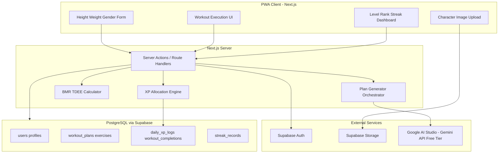
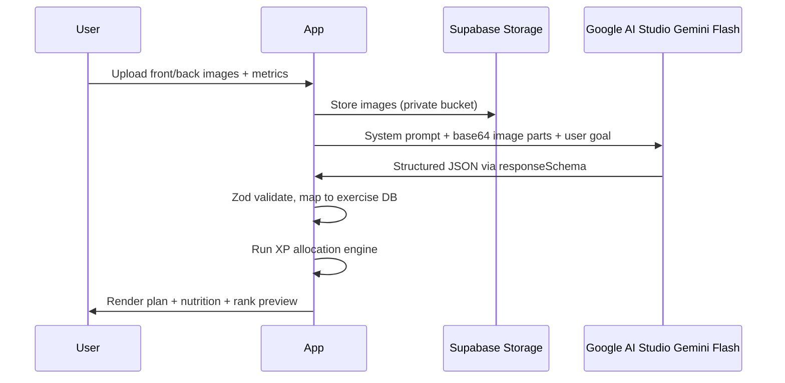

# Anime Workout RPG — Project Blueprint

## Product Summary

Users upload front/back reference images of an anime character, enter height/weight/gender for BMR/TDEE-based nutrition targets, receive an AI-generated physique-aligned workout plan, and execute daily routines in a gamified loop capped at **50 XP/day** with level/rank progression and streak retention.

**Platform:** Responsive web app + PWA (installable, offline-friendly workout view).

**Recommended database:** **PostgreSQL via Supabase + Prisma** — relational integrity for daily XP caps, streak idempotency, and audit logs beats MongoDB for this use case. AI-generated plans are stored as JSONB columns inside Postgres (best of both worlds).

**External dependencies (AI):** **Google AI Studio — 100% Free Developer Tier** using **Gemini 2.5 Flash** or **Gemini 3 Flash** for multimodal character analysis and structured plan generation. No OpenAI, Anthropic, or other paid Vision LLM APIs in the MVP scope.

---

## Architecture Overview



**Architectural rule — non-billing path only:** All Gemini integration must use **Google AI Studio** (`aistudio.google.com`) with a **free-tier API key** and the **`@google/genai` SDK** pointed at the AI Studio endpoint. Do **not** attach a Google Cloud billing account, enable Vertex AI, or use pay-as-you-go Cloud project credentials. Store the key only in `.env.local` as `GEMINI_API_KEY` (never commit). This keeps the project on the 100% free developer path and prevents accidental charges.

---

## 1. Gamification Logic and XP Algorithm

### 1.1 Core Constants

| Constant | Value | Purpose |
|----------|-------|---------|
| `DAILY_XP_CAP` | 50 | Hard ceiling per user per calendar day (user timezone) |
| `DIFFICULTY_TIERS` | 0.6 – 1.5 | Multiplier per exercise variation |
| `MIN_XP_PER_SET` | 0.5 | Floor so tiny sets still feel rewarding |
| `LEVEL_BASE_XP` | 100 | XP required for level 2; scales exponentially |

### 1.2 Difficulty Tier Table (seed data)

Store in `exercise_variations` table:

| Tier | Label | Multiplier | Example |
|------|-------|------------|---------|
| T1 | Beginner | 0.60 | Wall push-ups, assisted pull-ups |
| T2 | Modified | 0.80 | Incline push-ups, band rows |
| T3 | Standard | 1.00 | Regular push-ups, bodyweight squats |
| T4 | Advanced | 1.25 | Decline push-ups, pistol squat progressions |
| T5 | Elite | 1.50 | One-arm push-up progressions, muscle-ups |

### 1.3 Daily XP Budget Allocation (dynamic, variable exercise count)

For a given day's routine with exercises `i = 1..N`:

**Step 1 — Compute workload score per exercise:**

```
workload_i = sets_i × reps_i × difficulty_multiplier_i × priority_weight_i
```

- `priority_weight_i` (default 1.0): optional boost for compound/primary movements (e.g., 1.2 for pull pattern if character has broad back emphasis from Gemini vision analysis).

**Step 2 — Allocate daily XP budget per exercise:**

```
total_workload = Σ workload_i
xp_budget_i = DAILY_XP_CAP × (workload_i / total_workload)
```

This guarantees `Σ xp_budget_i = 50` regardless of N.

**Step 3 — XP per completed set:**

```
xp_per_set_i = max(MIN_XP_PER_SET, xp_budget_i / sets_i)
```

**Step 4 — Optional rep-level granularity** (for partial set completion):

```
xp_per_rep_i = xp_budget_i / (sets_i × reps_i)
award = min(remaining_daily_xp, completed_reps × xp_per_rep_i)
```

**Example:** 4-exercise day — Push-ups (3×12, T3), Rows (3×10, T3), Squats (4×15, T2), Plank (3×60s, T3). Convert timed holds to rep-equivalents (e.g., 60s plank = 12 rep-units).

| Exercise | Workload | XP Budget | XP/Set |
|----------|----------|-----------|--------|
| Push-ups | 36.0 | 12.9 | 4.3 |
| Rows | 30.0 | 10.7 | 3.6 |
| Squats | 48.0 | 17.1 | 4.3 |
| Plank | 36.0 | 9.3 | 3.1 |
| **Total** | **150.0** | **50.0** | — |

### 1.4 Awarding XP (server-side, idempotent)

```typescript
// lib/xp/award-xp.ts (conceptual)
async function awardSetXp(userId: string, completionId: string) {
  // 1. Idempotency: reject if completionId already processed
  // 2. Load today's daily_xp_log (upsert row keyed by userId + localDate)
  // 3. remaining = DAILY_XP_CAP - dailyLog.earnedXp
  // 4. award = min(xpPerSet, remaining)
  // 5. Transaction: insert completion, increment dailyLog, increment profile.totalXp
  // 6. Recalculate level/rank from totalXp
  // 7. Return { awarded, capped: award < xpPerSet, dailyTotal, levelUp? }
}
```

**Anti-spoofing rules:**
- XP only awarded on server after set marked complete (never trust client totals).
- One completion record per `(userId, planExerciseId, setNumber, localDate)`.
- Daily cap enforced in DB transaction with row-level lock on `daily_xp_logs`.
- Optional: require minimum time-between-sets (e.g., 15s) to deter spam-clicking.

### 1.5 Level and Rank Formulas

**Level (exponential curve — slows early grind, extends retention):**

```
level = floor(sqrt(total_xp / LEVEL_BASE_XP)) + 1
xp_for_next_level = (level)^2 × LEVEL_BASE_XP
```

| Total XP | Level |
|----------|-------|
| 0–99 | 1 |
| 100–399 | 2 |
| 400–899 | 3 |
| 900–1599 | 4 |

**Rank tiers (anime-inspired, mapped to level):**

| Rank | Title | Level Range |
|------|-------|-------------|
| F | Novice Adventurer | 1–5 |
| E | Guild Recruit | 6–10 |
| D | Rising Hunter | 11–18 |
| C | Elite Fighter | 19–28 |
| B | Ace Captain | 29–40 |
| A | Legendary Warrior | 41–55 |
| S | Hero-Class | 56+ |

Unlock cosmetics (rank badge, profile border, character title) at rank boundaries — no pay-to-win.

### 1.6 Streak Logic

```
onWorkoutComplete(userId, localDate):
  if lastStreakDate == localDate: return // already counted today
  if lastStreakDate == localDate - 1 day: currentStreak += 1
  else: currentStreak = 1
  longestStreak = max(longestStreak, currentStreak)
  lastStreakDate = localDate
```

Use `users.timezone` (IANA string, e.g., `America/New_York`) for all date boundaries. Award streak milestone bonuses (cosmetic only, not XP) at 7/30/100 days to avoid cap bypass.

---

## 2. Database Schema (PostgreSQL + Prisma)

Primary files: [`prisma/schema.prisma`](prisma/schema.prisma), [`lib/db/`](lib/db/)

```prisma
// Core models (abbreviated — full schema in implementation)

model User {
  id            String   @id @default(cuid())
  email         String   @unique
  timezone      String   @default("UTC")
  heightCm      Float?
  weightKg      Float?
  gender        Gender?  // MALE | FEMALE | OTHER
  bmr           Float?
  tdee          Float?
  calorieTarget Float?   // TDEE ± deficit/surplus
  goal          Goal?    // CUT | BULK | MAINTAIN
  totalXp       Int      @default(0)
  level         Int      @default(1)
  rank          Rank     @default(F)
  currentStreak Int      @default(0)
  longestStreak Int      @default(0)
  lastWorkoutDate DateTime?
  profile       UserProfile?
  plans         WorkoutPlan[]
  dailyXpLogs   DailyXpLog[]
  completions   WorkoutCompletion[]
}

model CharacterReference {
  id          String @id @default(cuid())
  userId      String
  frontImageUrl String
  backImageUrl  String
  visionAnalysis Json?  // structured LLM output
  plans       WorkoutPlan[]
}

model WorkoutPlan {
  id          String @id @default(cuid())
  userId      String
  characterId String?
  name        String  // e.g., "Zoro — Upper Body Arc"
  phase       PlanPhase // BULK | CUT | RECOMP
  isActive    Boolean @default(true)
  days        WorkoutDay[]
  nutrition   NutritionPlan?
}

model WorkoutDay {
  id       String @id @default(cuid())
  planId   String
  dayIndex Int     // 0=Mon or rotation index
  name     String
  exercises WorkoutDayExercise[]
}

model Exercise {
  id          String @id @default(cuid())
  slug        String @unique
  name        String
  muscleGroup MuscleGroup
  variations  ExerciseVariation[]
}

model ExerciseVariation {
  id                   String @id @default(cuid())
  exerciseId           String
  name                 String
  difficultyTier       Int    // 1-5
  difficultyMultiplier Float
}

model WorkoutDayExercise {
  id            String @id @default(cuid())
  dayId         String
  variationId   String
  sets          Int
  reps          Int
  priorityWeight Float @default(1.0)
  orderIndex    Int
  // Denormalized at plan generation time for audit:
  xpBudget      Float?
  xpPerSet      Float?
}

model DailyXpLog {
  id        String   @id @default(cuid())
  userId    String
  localDate DateTime @db.Date
  earnedXp  Float    @default(0)
  cap       Int      @default(50)
  @@unique([userId, localDate])
}

model WorkoutCompletion {
  id              String   @id @default(cuid())
  userId          String
  dayExerciseId   String
  setNumber       Int
  repsCompleted   Int
  xpAwarded       Float
  localDate       DateTime @db.Date
  completedAt     DateTime @default(now())
  @@unique([userId, dayExerciseId, setNumber, localDate])
}

model NutritionPlan {
  id            String @id @default(cuid())
  planId        String @unique
  dailyCalories Int
  proteinG      Int
  carbsG        Int
  fatG          Int
  mealStructure Json   // AI-generated meal templates
}
```

**Key indexes:** `(userId, localDate)` on `DailyXpLog` and `WorkoutCompletion`; `(userId, isActive)` on `WorkoutPlan`.

**Nutrition calculation (stored on profile update):**

```
BMR (Mifflin-St Jeor):
  Male:   10×weight + 6.25×height - 5×age + 5
  Female: 10×weight + 6.25×height - 5×age - 161

TDEE = BMR × activityFactor  // default 1.55 (moderate) for MVP
CUT:   TDEE - 400 kcal
BULK:  TDEE + 300 kcal
Protein: 1.8 g/kg bodyweight (adjustable)
```

---

## 3. AI Prompting Strategy (Google AI Studio / Gemini Flash)

### 3.1 Pipeline



### 3.1.1 SDK Integration (`@google/genai`)

Backend plan generation uses the official **`@google/genai`** SDK (not REST wrappers or paid middleware). Configure the client with the AI Studio free-tier key from `process.env.GEMINI_API_KEY`.

Structured output is enforced **natively by Gemini** via generation config — no fragile markdown stripping or third-party JSON repair:

```typescript
// lib/ai/generate-plan.ts (conceptual)
import { GoogleGenAI } from "@google/genai";

const ai = new GoogleGenAI({ apiKey: process.env.GEMINI_API_KEY });

const response = await ai.models.generateContent({
  model: "gemini-2.5-flash", // or "gemini-3-flash" when available on free tier
  contents: [
    { role: "user", parts: [
      { text: systemPrompt },
      { inlineData: { mimeType: "image/jpeg", data: frontBase64 } },
      { inlineData: { mimeType: "image/jpeg", data: backBase64 } },
    ]},
  ],
  config: {
    responseMimeType: "application/json",
    responseSchema: workoutPlanJsonSchema, // Gemini Schema object mirroring Zod shape
  },
});

const plan = JSON.parse(response.text); // already valid JSON from responseSchema
```

- **`responseMimeType: "application/json"`** — forces JSON output.
- **`responseSchema`** — constrains fields to the workout/nutrition schema (mirrors Section 3.3); Gemini validates structure server-side.
- **Zod** remains a second-pass validator before DB writes (slug whitelist, numeric bounds).
- **Images:** Server Action reads uploaded `File` buffers, encodes to base64, and passes as `inlineData` parts (no public URL required for inference).

### 3.2 System Prompt (Vision Analysis + Plan Generation)

```
You are an expert strength coach and anime physique analyst.

Analyze the reference character images and the user's biometrics.
Output ONLY valid JSON matching the schema below. Do not include markdown.

Goals:
1. Infer visible physique emphasis (muscle groups, leanness, proportions).
2. Map to realistic calisthenics/resistance exercises (no fictional moves).
3. Assign difficulty tiers 1-5 per exercise based on typical beginner fitness.
4. Respect user goal: CUT (higher volume, conditioning), BULK (compound emphasis), MAINTAIN.

Safety rules:
- No extreme volume (>20 sets per muscle group/day).
- Include antagonist balance (push/pull/legs/core).
- Flag if character physique is unrealistic; suggest achievable proxy goal.

User context:
- Height: {heightCm} cm, Weight: {weightKg} kg, Gender: {gender}
- Goal: {goal}, TDEE target: {calorieTarget} kcal
- Equipment: bodyweight only (MVP)
```

### 3.3 Expected JSON Schema (validate with Zod)

```json
{
  "characterAnalysis": {
    "physiqueType": "athletic_lean | muscular_bulk | slim_toned",
    "emphasisMuscleGroups": ["shoulders", "lats", "core"],
    "realismNote": "string",
    "animeRankFlavor": "B-Tier First Mate"
  },
  "workoutPlan": {
    "name": "string",
    "daysPerWeek": 4,
    "days": [
      {
        "name": "Pull Power Day",
        "exercises": [
          {
            "exerciseSlug": "pull_up",
            "variationName": "Assisted Pull-Up",
            "difficultyTier": 2,
            "sets": 3,
            "reps": 8,
            "priorityWeight": 1.2,
            "notes": "Use resistance band"
          }
        ]
      }
    ]
  },
  "nutritionPlan": {
    "dailyCalories": 2200,
    "proteinG": 130,
    "carbsG": 220,
    "fatG": 70,
    "mealTemplates": [
      { "meal": "Breakfast", "suggestion": "Greek yogurt, oats, banana" }
    ]
  }
}
```

### 3.4 Post-Generation Processing

1. **Parse** `response.text` as JSON (already schema-constrained by Gemini `responseSchema`).
2. **Zod validate** response; retry once with error feedback if invalid.
3. **Resolve slugs** to `Exercise` + `ExerciseVariation` IDs from seed catalog (~40 exercises for MVP).
4. **Run XP allocator** — persist `xpBudget` and `xpPerSet` on each `WorkoutDayExercise`.
5. **Store raw Gemini output** in `CharacterReference.visionAnalysis` for debugging/regeneration.

**Model recommendation:** **Gemini 2.5 Flash** or **Gemini 3 Flash** via **Google AI Studio Free Developer Tier** — multimodal vision + native `responseSchema` / `responseMimeType: "application/json"` at zero cost within free-tier rate limits.

---

## 4. Tech Stack Recommendation

| Layer | Choice | Rationale |
|-------|--------|-----------|
| Framework | **Next.js 15 (App Router)** | SSR for landing, Server Actions for XP mutations, PWA support |
| Language | **TypeScript** | End-to-end type safety with Prisma + Zod |
| Styling | **Tailwind CSS + shadcn/ui** | Fast, mobile-first UI; anime RPG aesthetic via custom theme |
| Auth | **Supabase Auth** | Email/OAuth, JWT, row-level security |
| Database | **Supabase PostgreSQL + Prisma** | Relational XP integrity, migrations, type-safe queries |
| File Storage | **Supabase Storage** | Private bucket for character images |
| State / Cache | **TanStack Query** | Optimistic UI for set completion; revalidate on XP award |
| Validation | **Zod** | LLM output, forms, API inputs |
| PWA | **next-pwa** or `@serwist/next` | Offline workout checklist, install prompt |
| AI | **Google AI Studio (`@google/genai`)** | Gemini 2.5 Flash / Gemini 3 Flash free tier; multimodal + native JSON schema (server-side only — never expose keys) |
| Deployment | **Vercel + Supabase** | Zero-config for solo dev; free tiers sufficient for MVP |
| Analytics | **PostHog** (optional Phase 3) | Funnel: upload → plan → first workout → day-7 retention |

**Fast XP updates pattern:**
- Server Action `completeSet()` → Postgres transaction → return new totals.
- TanStack Query `onMutate` optimistic update with rollback on cap/error.
- Supabase Realtime optional for multi-device sync (Phase 4).

**Project structure:**

```
app/
  (auth)/login, signup
  (app)/dashboard, workout/[dayId], profile, progress
  api/ (webhooks if needed)
components/  ui/, workout/, gamification/
lib/
  xp/          allocate.ts, award.ts, level.ts
  nutrition/   bmr.ts
  ai/          prompts.ts, generate-plan.ts, gemini-schema.ts
  db/          prisma client
prisma/schema.prisma
public/manifest.json
```

---

## 5. Phase-by-Phase MVP Roadmap (Solo Developer)

### Phase 0 — Foundation (Week 1)
- Scaffold Next.js + Tailwind + shadcn + Prisma + Supabase.
- Supabase Auth (email magic link or Google).
- Deploy hello-world to Vercel; connect Supabase project.
- **Exit criteria:** User can sign up/login; empty dashboard renders.

### Phase 1 — Metrics and Nutrition (Week 2)
- Profile form: height, weight, gender, age, goal, timezone.
- BMR/TDEE calculator + calorie/macro display.
- Prisma migrations for `User`, `UserProfile`.
- **Exit criteria:** Saved profile shows cut/bulk calorie target and macros.

### Phase 2 — Exercise Catalog and XP Engine (Week 3)
- Seed ~40 exercises with 2–4 variations each (difficulty tiers).
- Implement `allocateDailyXp()` and `awardSetXp()` with unit tests.
- `DailyXpLog` + cap enforcement with test cases (4 vs 8 exercise days, tier mix).
- **Exit criteria:** Pure function tests pass; cap never exceeds 50 in simulation.

### Phase 3 — Workout Execution UI (Week 4)
- Active plan day view: exercise cards, set checkboxes, rep counters.
- Server Action on set complete → XP toast, progress bar (daily 0/50).
- Level/rank display component; streak counter on dashboard.
- PWA manifest + service worker for offline day view.
- **Exit criteria:** Manual plan (hardcoded) completable end-to-end with XP/streak/level updating.

### Phase 4 — AI Plan Generation (Week 5–6)
- Create a **free API key** at [Google AI Studio](https://aistudio.google.com/apikey) (no billing account required).
- Add `GEMINI_API_KEY=<your-key>` to `.env.local`; add `.env.local` to `.gitignore`; mirror key in Vercel project env vars for production.
- Install `@google/genai`; implement `lib/ai/generate-plan.ts` with `responseSchema` + `responseMimeType: "application/json"`.
- Write Next.js **Server Action** `generateWorkoutPlan()` that:
  1. Accepts front/back image `File` uploads + user metrics from the client.
  2. Converts image buffers to **base64** strings server-side.
  3. Calls Gemini Flash with system prompt, inline base64 image parts, and structured output config.
  4. Zod-validates response, runs XP allocator, persists plan to Postgres.
- Image upload to Supabase Storage (front/back) for user reference and re-generation.
- Plan persistence: `CharacterReference`, `WorkoutPlan`, `WorkoutDay`, exercises.
- "Regenerate plan" and "Adjust difficulty" flows (respect free-tier rate limits).
- **Exit criteria:** Upload anime character → receive personalized 3–4 day plan with correct XP splits via Gemini Flash free tier.

### Phase 5 — Progression Polish and Retention (Week 7)
- Progress page: XP history chart, rank badge, streak milestones.
- Rank-up and level-up modal animations (anime flair).
- Daily reminder (email via Supabase or Resend) — optional.
- **Exit criteria:** 7-day streak milestone unlocks cosmetic badge.

### Phase 6 — Beta Hardening (Week 8)
- Rate limiting on AI endpoints (prevent abuse).
- Error boundaries, loading skeletons, empty states.
- Basic admin seed script for exercises.
- Privacy: delete account + images flow.
- **Exit criteria:** 5 beta users complete full loop without manual DB fixes.

---

## Risk Mitigation

| Risk | Mitigation |
|------|------------|
| LLM hallucinates unsafe exercises | Gemini `responseSchema` + Zod + slug whitelist; reject unknown exercises |
| Accidental Gemini billing | AI Studio free key only; no Vertex AI / Cloud billing; document in README |
| XP farming via refresh | Idempotent completion keys + server-side cap |
| Streak timezone bugs | Store IANA timezone; compute `localDate` server-side |
| Unrealistic anime body goals | `realismNote` in LLM output + disclaimer UI |
| Image privacy | Private Supabase bucket; signed URLs; deletion on account delete |

---

## Suggested First Implementation Slice

After plan approval, start with **Phase 0 + Phase 2** in parallel logic-first order:
1. Monorepo scaffold and auth.
2. XP engine with tests (no UI dependency).
3. Hardcoded workout day to validate gamification loop before AI complexity.

This de-risks the hardest invariant (**50 XP/day cap + fair distribution**) before Gemini Flash integration.
